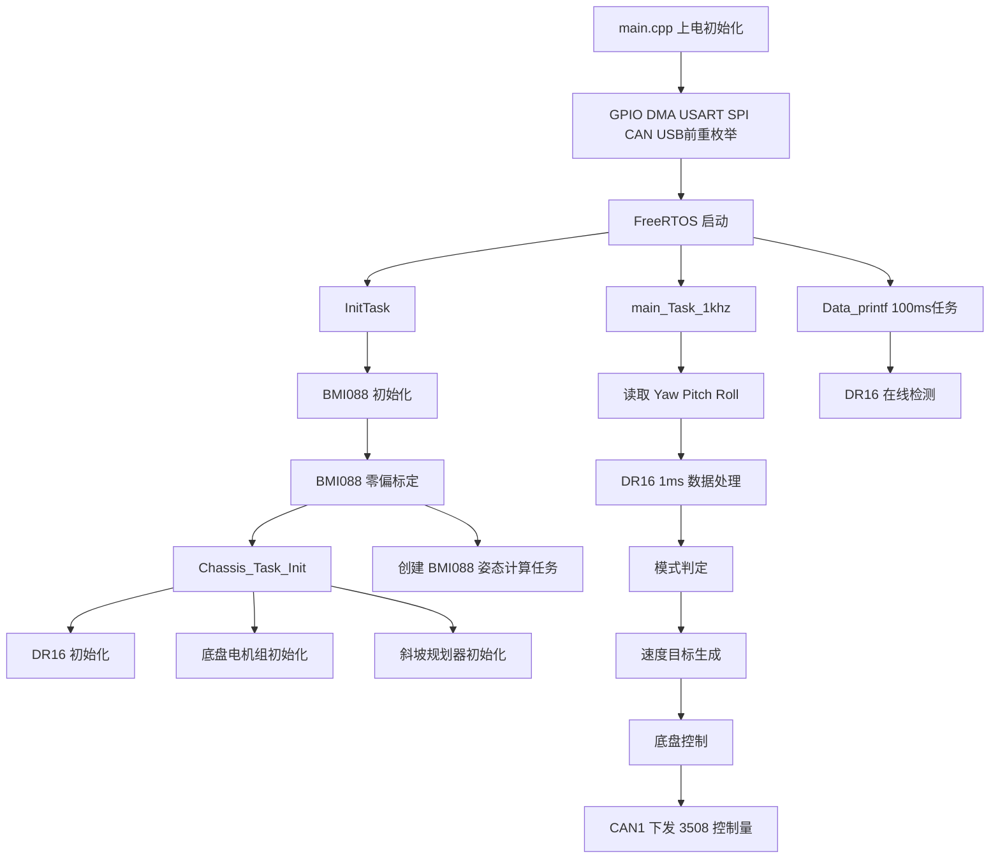

# STM32 F405 底盘控制工程

基于 `STM32F405RGT6 + HAL + FreeRTOS + CubeMX + CMake` 的四轮麦克纳姆底盘控制工程。

当前仓库已经接入并联调的主链路是：

- `BMI088` 姿态传感器
- `DR16` 遥控器输入
- `4 x DJI 3508` 底盘电机
- `CAN1` 电机总线
- `USB CDC` 调试输出
- `C++` 业务逻辑与控制层

这份 README 以当前仓库代码为准，重点说明已经落地的功能、目录分层、任务模型、控制模式和开发方式。

## 1. 项目现状

当前工程不是“空模板”，而是一个已经具备完整控制闭环的底盘工程：

- 上电后先完成 `BMI088` 初始化与零偏标定。
- `DR16` 通过 `USART3 + DMA + IDLE` 接收并解析遥控数据。
- 主控制任务以 `1 ms` 周期运行，完成姿态读取、遥控数据处理、模式判定和底盘控制输出。
- 底盘采用 `4 路 3508` 电机，经 `CAN1` 下发控制量并回读反馈。
- 已实现普通行驶、小陀螺、正弦小陀螺、停止和无力等模式。
- 调试打印默认走 `USB CDC`，也保留了串口打印后端。

## 2. 软件主流程



## 3. 当前已实现的控制功能

### 3.1 底盘闭环

当前 `Usercode/3_application/Chassis` 中实际使用的是：

- 底盘目标速度 `Vx / Vy / Vz`
- 四轮逆解得到各电机目标角速度
- 由四轮反馈反解底盘当前 `X / Y / w`
- `X / Y / W` 三路 PID 计算底盘目标力
- 力矩分配后转换为 3508 电机电流控制量
- 通过 `CAN1` 发送到电机组

默认控制路径是：

`目标速度 -> 底盘速度PID -> 目标力 -> 电机目标力矩 -> 电机电流输出`

### 3.2 斜坡规划

在 `Chassis_Task.cpp` 中，`Vx / Vy / Vz` 三个维度都做了斜坡规划：

- `X/Y` 加速度：`5.0`
- `Z` 加速度：`30.0`
- 控制步长：`1 ms`

作用是减小摇杆突变带来的机械冲击。

### 3.3 小陀螺模式

当前“小陀螺”不是单纯固定角速度旋转，而是加入了姿态融合与随动修正：

- 使用 `BMI088` 角速度与轮式里程计角速度同时估计旋转状态
- 通过 `innovation-gated` 方式在线修正 IMU 漂移
- 将遥控速度从“云台/遥控系”变换到底盘坐标系
- 进入小陀螺模式时会重置跟随角度，避免模式切换残留

### 3.4 斜坡重力前馈

在小陀螺和停止刹车阶段，代码会根据 `Pitch / Roll` 做重力补偿：

- 当 `|Pitch| > 10 deg` 或 `|Roll| > 10 deg` 时启用
- 通过底盘质量和姿态角估计额外补偿力

这部分逻辑已经在 `Chassis.cpp` 中接入。

## 4. 遥控映射与模式切换

### 4.1 摇杆映射

当前代码中的底盘目标速度映射为：

- `Left_X -> Vx`
- `Left_Y -> Vy`
- `Right_X -> Vz`，代码中取负号

也就是说，当前项目以代码定义为准，不强行假设“前后/左右/旋转”的实体方向；如果机械安装方向调整，只需要同步修改控制映射或电机顺序。

### 4.2 速度档位

低速档：

- `Vx` 最大值：`1.0 m/s`
- `Vy` 最大值：`1.0 m/s`
- `Vz` 最大值：`3.0 rad/s`

高速档：

- `Vx` 最大值：`1.5 m/s`
- `Vy` 最大值：`1.5 m/s`
- `Vz` 最大值：`6.0 rad/s`

正弦小陀螺参数：

- 最小角速度：`5.0 rad/s`
- 最大角速度：`7.0 rad/s`
- 频率：`0.8 Hz`

### 4.3 拨杆模式表

代码里用 `Left_Switch` 和 `Right_Switch` 组合切换底盘状态，当前逻辑如下：

| 左拨杆 | 右拨杆 | 模式 |
| --- | --- | --- |
| 中 | 中 | 普通行驶低速 |
| 中 | 上 | 普通行驶高速 |
| 上 | 中 | 小陀螺低速 |
| 上 | 上 | 小陀螺高速 |
| 上 | 下 | 正弦小陀螺 |
| 下 | 中 | 停止模式 |
| 下 | 下 | 无力模式 |
| 其他组合 | - | 错误模式 |

### 4.4 模式保护

当前代码里还有几条重要保护策略：

- `DR16` 掉线时，强制进入 `Stop_Mode`
- 从任意模式切换到新模式时，自动清空 PID 积分项和斜坡规划残留
- `Stop_Mode` 会先刹停约 `1 s`，然后再切换到 `No_Power_Mode`

## 5. FreeRTOS 任务模型

当前任务模型由 `Core/Src/freertos.c` 创建、由 `Usercode/3_application` 实现：

| 任务名 | 优先级 | 作用 |
| --- | --- | --- |
| `InitTask` | `osPriorityRealtime7` | 初始化 USB、BMI088，等待标定完成后初始化底盘 |
| `main_Task_1khz` | `osPriorityRealtime6` | 主 1ms 控制任务 |
| `imu_calculate` | `osPriorityRealtime5` | BMI088 姿态解算任务，初始化完成后创建 |
| `Data_ptintf` | `osPriorityRealtime4` | 100ms 周期任务，目前主要负责 DR16 存活检测 |

补充说明：

- `InitTask` 在 BMI088 初始化完成后会调用 `Chassis_Task_Init()`，然后自删除。
- `main_Task_1khz` 是当前底盘的主业务循环。
- `imu_calculate` 由 BMI088 数据就绪中断触发任务通知，不是简单轮询。

## 6. 外设与接口映射

### 6.1 当前主链路外设

| 外设 | 当前用途 | 关键信息 |
| --- | --- | --- |
| `SPI1` | BMI088 通信 | `PA5/PA6/PA7` |
| `PC4` | BMI088 ACC 片选 | GPIO 输出 |
| `PB1` | BMI088 GYRO 片选 | GPIO 输出 |
| `PB0` | BMI088 ACC 中断 | EXTI 上升沿 |
| `PC5` | BMI088 GYRO 中断 | EXTI 上升沿 |
| `USART3` | DR16 遥控器 | `100000, 9E1, DMA+IDLE` |
| `CAN1` | 3508 电机总线 | `PB8/PB9` |
| `USB FS` | USB CDC 调试输出 | `PA11/PA12` |

### 6.2 已初始化但当前主流程未实际绑定业务的外设

下面这些外设在 `main.cpp` 里会初始化，但当前仓库主功能里没有接到核心控制链路：

- `CAN2`
- `USART1`
- `USART6`
- `UART5`

它们更适合作为后续扩展接口，而不是 README 中宣称的“已完成功能”。

## 7. 当前关键参数

来自 `Usercode/3_application/Chassis/chassis.h` 的底盘参数：

- 轮半径参数：`0.0815`
- 底盘半径参数：`0.2125`
- 减速比：`15.764705882453`
- 底盘质量：`7.7 kg`

当前 4 个底盘电机初始化顺序为：

- 电机槽位 0 -> CAN ID `4`
- 电机槽位 1 -> CAN ID `1`
- 电机槽位 2 -> CAN ID `2`
- 电机槽位 3 -> CAN ID `3`

这说明代码已经按实际机械接线顺序做过映射，接线变动时要同步修改 `Chassis_Init()`。

## 8. 目录结构

```text
.
├─ Core/                         # CubeMX 生成的核心初始化、RTOS、启动文件
├─ Drivers/                      # HAL / CMSIS
├─ Middlewares/                  # FreeRTOS、USB Device 等中间件
├─ USB_DEVICE/                   # USB CDC 设备栈
├─ Usercode/
│  ├─ 1_bsp/                     # 板级驱动封装
│  │  ├─ CAN/                    # CAN 过滤器、收发回调
│  │  ├─ DWT/                    # 微秒级计时封装
│  │  ├─ MyRTOS/                 # RTOS 通知辅助封装
│  │  ├─ SPI/                    # SPI 异步封装
│  │  ├─ USART/                  # DMA + IDLE 串口封装
│  │  └─ USB/                    # USB CDC 收发与 Printf
│  ├─ 2_module/                  # 通用模块层
│  │  ├─ Alg/                    # PID、Mahony、SlopePlaning、MyMath 等算法
│  │  ├─ bmi088/                 # BMI088 底层驱动
│  │  ├─ DJI_Motor/              # 3508 / 6020 电机封装
│  │  ├─ DR16/                   # DR16 协议解析
│  │  └─ Serial/                 # 串口日志与环形缓冲
│  └─ 3_application/             # 业务层
│     ├─ bmi088/                 # BMI088 初始化、标定、姿态解算
│     ├─ Chassis/                # 底盘模型与控制
│     └─ Chassis_Task/           # 模式状态机与任务编排
├─ cmake/                        # 工具链与 CubeMX 转 CMake 子工程
├─ CMakeLists.txt                # 工程总入口
├─ CMakePresets.json             # Debug/Release 预设
├─ F405RGT6Project.ioc           # CubeMX 工程文件
├─ GeneratorBefore.bat           # CubeMX 生成前处理
├─ GeneratorAfter.bat            # CubeMX 生成后处理
└─ STM32F405XX_FLASH.ld          # 链接脚本
```

## 9. 分层说明

### `Core / Drivers / Middlewares / USB_DEVICE`

这部分主要由 `CubeMX / HAL` 生成和维护，不建议把业务逻辑直接堆进去。

### `Usercode/1_bsp`

负责和具体外设打交道，提供统一接口：

- `bsp_usart.cpp` 使用 `HAL_UARTEx_ReceiveToIdle_DMA`
- `bsp_can.c` 提供过滤器配置和 FIFO 回调注册
- `bsp_usb.cpp` 提供 `USB_Printf()` 和双缓冲收包流程

### `Usercode/2_module`

放可复用模块：

- `DR16` 协议解析、死区处理、轴向辅助
- `DJI_Motor` 电机组封装
- `Alg` 目录中的 PID、滤波、姿态算法等

### `Usercode/3_application`

面向当前底盘项目本身：

- 任务编排
- 模式状态机
- 姿态标定与解算
- 底盘控制律

## 10. 构建方式

### 10.1 环境要求

建议至少具备：

- `CMake 3.22+`
- `Ninja`
- `arm-none-eabi-gcc / g++`

如果需要修改外设配置，还需要：

- `STM32CubeMX`

### 10.2 使用 Preset 构建

仓库自带 `Debug / Release` 两套预设：

```bash
cmake --preset Debug
cmake --build --preset Debug
```

或：

```bash
cmake --preset Release
cmake --build --preset Release
```

默认 `binaryDir` 在：

```text
build-vscode/Debug
build-vscode/Release
```

### 10.3 如果本地缓存有旧生成器

如果你之前用过别的 IDE 或生成器，`build-vscode/*` 里可能残留旧的 `CMakeCache.txt`。

这种情况下直接重新配置可能会报：

- 生成器不匹配
- Ninja 路径失效
- 本地旧缓存引用了已经不存在的工具

处理方式很简单：删除对应构建目录后重新 `cmake --preset ...` 即可。

## 11. CubeMX 与 C++ 协同方式

当前工程实际编译入口使用的是：

- `Core/Src/main.cpp`
- `USB_DEVICE/App/usbd_cdc_if.cpp`

而不是 CubeMX 默认生成的：

- `main.c`
- `usbd_cdc_if.c`

为保证 CubeMX 仍能正常生成，仓库用了两步脚本配合：

- `GeneratorBefore.bat`
  - 在生成前把 `main.cpp` 临时改回 `main.c`
- `GeneratorAfter.bat`
  - 生成后再恢复为 `main.cpp`
  - 删除 `USB_DEVICE/App/usbd_cdc_if.c`

同时在顶层 `CMakeLists.txt` 里把 CubeMX 视角下的 `main.c` 和 `usbd_cdc_if.c` 标成 `HEADER_FILE_ONLY`，避免和 `.cpp` 版本重复编译。

## 12. 调试与日志

当前日志宏定义在 `Usercode/3_application/Chassis_Task/Chassis_Task.h`：

```c
#ifndef STM32_PRINTF_USE_USB
#define STM32_PRINTF_USE_USB 1
#endif
```

默认：

- `STM32_Printf(...) -> USB_Printf(...)`

也可以切到：

- `STM32_Printf(...) -> Serial_Printf(...)`

当前 `BMI088` 初始化与标定过程会输出较多日志，最适合通过 `USB CDC` 观察。

## 13. 当前代码里值得知道的几点

### 已经真正接入的

- `DR16 -> 模式判定 -> 底盘目标速度 -> 3508 电机输出`
- `BMI088 -> 姿态角 -> 小陀螺修正 / 斜坡重力补偿`
- `USB CDC -> 调试打印`

### 已经封装但当前主流程未使用的

- `Serial` 接收环形缓冲接口
- `USB` 收包回调应用层注册
- `CAN2` 电机或模块扩展
- `USART1 / USART6 / UART5` 的应用层绑定

### 开发时最容易忽略的一点

`Usercode/3_application/CMakeLists.txt` 不是自动递归收集源文件，而是手动维护 `APP_SOURCES`。

也就是说：

- 新增应用层 `.c/.cpp` 文件后
- 需要手动把文件路径加到 `APP_SOURCES`

否则文件不会参与编译。

## 14. 推荐开发入口

如果你要继续在这个仓库上开发，最常改的通常是下面几处：

- `Usercode/3_application/Chassis/`
  - 修改底盘参数、控制链路、前馈
- `Usercode/3_application/Chassis_Task/`
  - 修改模式切换、遥控映射、任务逻辑
- `Usercode/3_application/bmi088/`
  - 修改姿态初始化、标定和解算流程
- `Usercode/2_module/DR16/`
  - 修改摇杆解析、死区和轴向辅助
- `Usercode/2_module/DJI_Motor/`
  - 修改电机映射或 CAN 反馈处理

## 15. 总结

当前仓库已经是一个可继续迭代的底盘控制工程，而不是仅有外设初始化的模板工程。它的核心特征是：

- `CubeMX` 负责底层初始化
- `CMake + C++` 负责工程组织与业务逻辑
- `FreeRTOS` 负责任务调度
- `BMI088 + DR16 + 3508 + CAN1` 构成当前可运行的底盘主链路

如果后续功能继续扩展，建议仍然保持现在的分层方式：

- `CubeMX` 管外设
- `bsp` 管抽象
- `module` 管通用能力
- `application` 管项目业务

